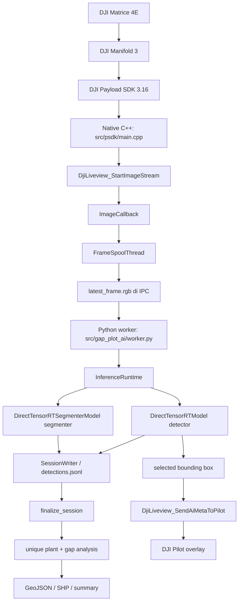

# Architecture

Dokumen ini menjelaskan arsitektur aplikasi berdasarkan source canonical v27 di repository ini.

## Flow Sistem



## Native C++ Application

File utama:

```text
src/psdk/main.cpp
```

Tanggung jawab native app:

- menurunkan path runtime saat aplikasi berjalan dari `/open_app/ggp-drone-ai` pada Manifold;
- menjalankan Python worker melalui `SpawnPythonWorker()`;
- inisialisasi PSDK melalui `DjiCore_Init()`;
- validasi aircraft melalui `ValidateAircraft()`;
- register widget Pilot melalui `InitWidget()`;
- subscribe telemetry melalui `InitTelemetry()`;
- start decoded RGB liveview melalui `StartLiveview()`;
- menerima frame melalui `ImageCallback()`;
- menulis frame terbaru ke IPC melalui `FrameSpoolThread()`;
- membaca hasil worker dari `latest_result.txt`;
- mengirim bounding box ke DJI Pilot melalui `DjiLiveview_SendAiMetaToPilot()`.

Function penting:

| Function | Peran |
|---|---|
| `InitializeDerivedPaths()` | Mengisi env runtime jika belum diset |
| `SpawnPythonWorker()` | Menjalankan `python3 -m gap_plot_ai.worker --backend engine` |
| `InitWidget()` | Register widget gimbal/start/stop dari `config/widget/{en,cn}_big_screen` |
| `StartLiveview()` | Inisialisasi liveview dan label AI |
| `StartImageSubscription()` | Request decoded RGB stream kamera M4E |
| `ImageCallback()` | Validasi RGB packed frame dan update latest-frame buffer |
| `FrameSpoolThread()` | Menulis frame ke IPC secara atomic |
| `BuildPilotMetadata()` | Konversi bounding box normalisasi ke koordinat DJI 0..10000 |
| `SendPilotMetadata()` | Kirim metadata overlay ke DJI Pilot |

## Widget Dan Lifecycle

Widget config canonical:

```text
config/widget/en_big_screen/widget_config.json
config/widget/cn_big_screen/widget_config.json
```

Mapping widget v27:

| Index | Tipe | Peran |
|---|---|---|
| 0 | switch | gimbal down / forward |
| 1 | button | Start AI |
| 2 | button | Stop AI |

`SetWidgetValue()` menulis state ke `control.txt`. Python worker membaca file tersebut untuk start/stop session.

## IPC Contract

Direktori IPC default pada Manifold:

```text
/dev/shm/ggp-drone-ai
```

File IPC penting:

| File | Writer | Reader | Isi |
|---|---|---|---|
| `latest_frame.rgb` | C++ `FrameSpoolThread()` | Python `read_frame()` | Header frame v2 + RGB payload |
| `control.txt` | C++ `WriteControls()` | Python `_read_control()` | Start/stop/snapshot state |
| `latest_result.txt` | Python `serialize_result()` | C++ `ParseResultFile()` | Hasil inference untuk overlay |
| `worker_status.json` | Python worker | Native/status operator | Heartbeat, state, metrics |

`src/gap_plot_ai/worker.py::read_frame()` membaca header binary yang membawa ukuran frame, stride, pixel format, timestamp, source frame id, dan telemetry.

## Python Worker

File:

```text
src/gap_plot_ai/worker.py
```

Flow `run()`:

1. load config dari `config/live.yaml`;
2. membuat `InferenceRuntime`;
3. polling `control.txt`;
4. ketika Start AI aktif, memanggil `runtime.start()`;
5. membaca `latest_frame.rgb`;
6. rate-limit sesuai `live.target_inference_fps`;
7. memanggil `runtime.infer_frame()`;
8. menulis `latest_result.txt`;
9. ketika Stop AI, memanggil `runtime.stop()`.

Known issue: pada source v27, `RegistrationFrameWriter` dibuat ketika session start tetapi segera di-reset ke `None`. Perilaku ini perlu direview sebelum mengandalkan registration frame untuk finalizer.

## InferenceRuntime

File:

```text
src/gap_plot_ai/runtime.py
```

`InferenceRuntime` mengelola lifecycle model dan session:

- `initialize()` memuat detector dan segmenter TensorRT;
- `warmup()` menjalankan warmup jika dikonfigurasi;
- `start()` membuka `SessionWriter`;
- `infer_frame()` menjalankan detector/segmenter dan menyimpan result;
- `stop()` menutup session dan memanggil `finalize_session()`.

Runtime v27 menggunakan:

```text
DirectTensorRTModel
DirectTensorRTSegmenterModel
```

## Finalizer Dan Gap Analysis

File:

```text
src/gap_plot_ai/finalizer.py
```

`finalize_session()`:

- membaca `detections.jsonl`;
- membaca frame processed jika tersedia;
- menghitung transform registration bila input tersedia;
- melakukan fusion detection menjadi unique plant;
- menjalankan `analyze_gaps()`;
- menulis output local/geographic-style, SHP, preview, summary, dan manifest.

Fix v27 untuk Blocker-001 berada di `_row_coords_to_local()` dan dipakai oleh `analyze_gaps()` saat mapping slot gap dari row-coordinate frame ke local-coordinate frame.

## Pilot Overlay Flow

```text
detector output
  -> overlay.select_overlay_detections()
  -> worker serialize_result()
  -> native ParseResultFile()
  -> confidence sort + cap
  -> BuildPilotMetadata()
  -> DjiLiveview_SendAiMetaToPilot()
  -> DJI Pilot
```

Overlay live saat ini berbasis bounding box metadata, bukan rendered H.264 contour stream. Gap analysis dilakukan pada finalization setelah session berhenti.

## Runtime Path Pada Manifold

Path berikut adalah path target pada Manifold, bukan path laptop developer:

| Path | Peran |
|---|---|
| `/open_app/ggp-drone-ai` | installed app root |
| `/open_app/ggp-drone-ai/payload` | payload Python dan config installed runtime |
| `/dev/shm/ggp-drone-ai` | IPC live frame/result/control |
| `/home/dji/ggp_drone_ai_data` | runtime data/session/export/log yang teramati |
| `/home/dji/gap_plot_ai_assets/models/engine` | lokasi TensorRT engine external |

## Batasan Saat Ini

Runtime ini tidak melakukan flight control, waypoint control, joystick control, atau aircraft movement. Source v27 memiliki widget untuk gimbal, tetapi prosedur dan validasinya tetap perlu diuji pada hardware sebelum dipakai operasional.
